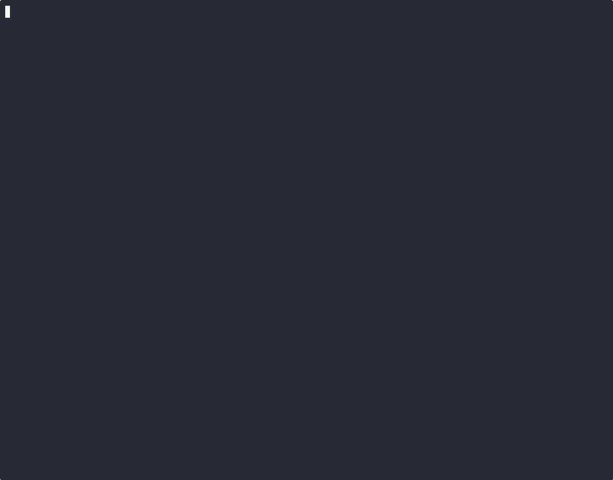

# Chronomaly

Chronomaly is a kernel exploit for the Android / Linux kernel using CVE-2025-38352. The exploit was written specifically for Linux kernel v5.10.157, but should work against all vulnerable v5.10.x kernels, as it does not require any specific kernel text offsets to work.

I covered the vulnerability in detail in a three-part blog post series, all the way from PoC to exploit:

- Part 1 - [In-the-wild Android Kernel Vulnerability Analysis + PoC](https://faith2dxy.xyz/2025-12-22/cve_2025_38352_analysis/)
- Part 2 - [Extending The Race Window Without a Kernel Patch](https://faith2dxy.xyz/2025-12-24/cve_2025_38352_analysis_part_2/)
- Part 3 - [Uncovering Chronomaly](https://faith2dxy.xyz/2026-01-03/cve_2025_38352_analysis_part_3/)

# Build Setup

This exploit has only been tested against an x86_64 Linux kernel v5.10.157 running in QEMU. I asked a friend to send me their Pixel 6a kernel config to base my kernel config off of, and these are the config options important for this exploit (I started from the kernelCTF config as a base):

- `CONFIG_POSIX_CPU_TIMERS_TASK_WORK=n`
- `CONFIG_PREEMPT=y` (Full Preemption, no RT)
- `CONFIG_SLAB_MERGE_DEFAULT=n`
- `DEBUG_LIST=n`
- `BUG_ON_DATA_CORRUPTION=n`
- `LIST_HARDENED=n`

To disable `CONFIG_POSIX_CPU_TIMERS_TASK_WORK`, you can follow the steps laid out in my first blog post [here](https://faith2dxy.xyz/2025-12-22/cve_2025_38352_analysis/#config_posix_cpu_timers_task_work).

Refer to the `qemu.sh` file for my QEMU run script. I used 4 cores and 3 GB RAM for testing.

# Exploit parameters

Since the exploit depends on CPU timers, there are two parameters you may need to change to adapt it to your environment.

First, `CPU_USAGE_THRESHOLD`. This parameter is used when consuming CPU time to fire the timers inside the `race_func()`. It must be set such that:

- The timers don't fire on every retry attempt (this would imply that `CPU_USAGE_THRESHOLD` is too high, as the timers are firing before the `race_func()` thread can exit).
- The timers only fire sometimes (this would imply that sometimes the timers fire before the thread exits, and other times it fires while the thread exits).

To determine whether the timers are firing or not, insert a `printf()` statement in the `SIGUSR1` polling code in `free_func()`. If you see the message print out, that means the timers fired.

Second, `PARENT_SETTIME_DELAY_US`. This parameter is used by the parent process to hit the 2nd race window inside `send_sigqueue()` at the same time as the child process. Run the exploit, observe, and modify it as follows:

- The message "Parent raced too late, readjusting..." appears too often – reduce this parameter. 
- The message "Parent raced too early, readjusting..." appears too often – increase this parameter.

Ideally, the exploit will work within 1 minute. If it doesn't, you'll have to a figure out which of the two parameters above you need to modify.

# Potential Improvements

In my cross-cache implementation, I assumed that the kernel is not too busy, and that there haven't been many `struct sigqueue` allocations. I added a comment in `sigqueue_crosscache_preallocs()` that explains what you would need to do improve this.

# Questions

If you have any questions, please contact me via X / Twitter!
